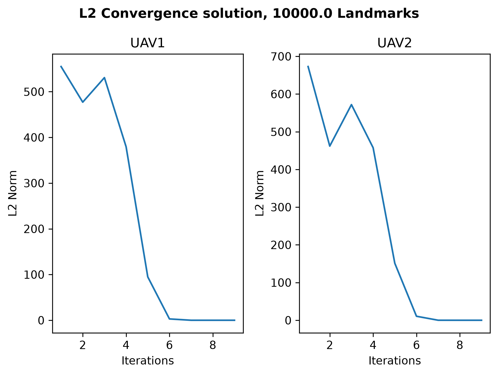
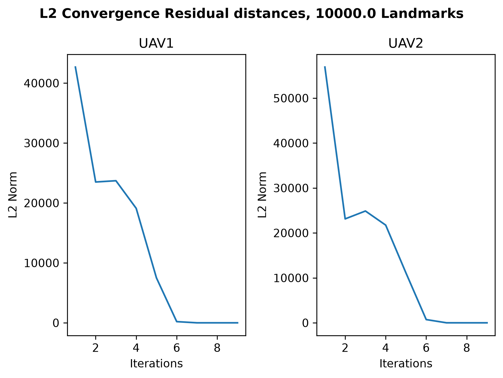
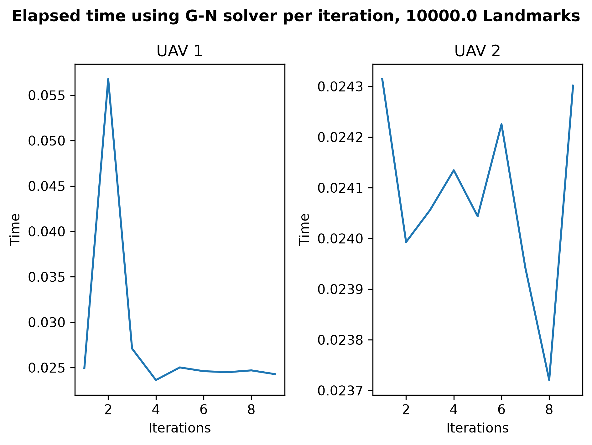
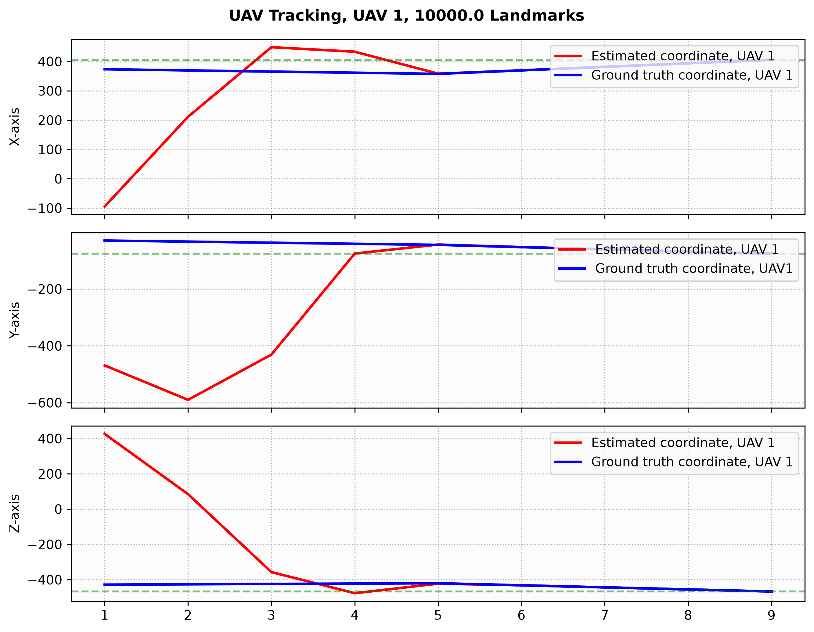
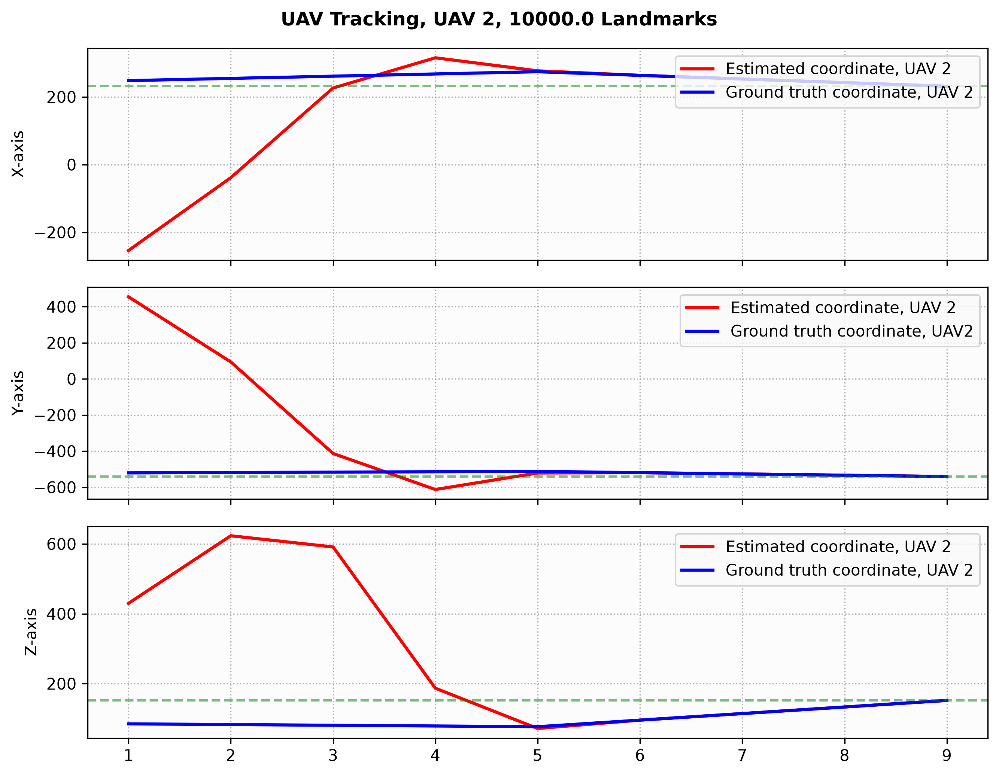

STUT, Alpha Release
--------------------------------------------------------------------------------------------------------------------------------------------------------------------------------------------------------------------------------------------

# 3D Isolated Multi-UAV State Estimator & Dynamic Data Assimilation System

A high-performance, header-only estimation framework designed in C++ to construct a radar system that aims to gather information about sensor coordinates of a sought number of UAVs. The project covers the Single-Targeted UAV Tracking (STUT) problem which is assumed under geometric and physical constraints. From a data assimilation perspective and the assumption that the UAVs are in the field where the landmarks are located, this architecture connects numerical linear algebra to a time-series kinematic model that relates to the Steepest Descent method.

--------------------------------------------------------------------------------------------------------------------------------------------------------------------------------------------------------------------------------------------

##  Project updates

Changes has been made in the project until its alpha release including:

- Upgrading the data structures such as MatrixObject and LinkedListObject with smart pointers std::unique_ptr
- Implement thin QR-decomposition of matrix structures using Givens rotations to estimate the matrix R and vector b_tilde = Q^Tb
- Developing the static STUT problem to follow a first order kinematic model to predict the movements of the UAVs in the next state
- Construct methods that generates the radar environment via pseudo-randomized seeds
- Optimizing the Gauss-Newton approach using a regularization term in the QR-decomposition method to prevent ill-posed behavior in the STUT solver
 - Embedded programming aspect to print convergence results to csv-files to then being plotted in Python for visualizations

--------------------------------------------------------------------------------------------------------------------------------------------------------------------------------------------------------------------------------------------

##  Performance Verification & Memory Safety

This project has been validated to be free from memory leaks, obvious bugs and other potential issues that relates to the constructed matrix and linked list structures.

- Memory leak/pointer issues: -fsanitize=adress under C++17 has been performed to both the test files and the main run file, proving free from memory leaks, troubled concerns with the pointers, and other vulnerabilities that might relate to the data structures.
- GoogleTest: Automatically verified via GTest suites that handles edge cases where exception throws accordingly and working examples for valid choices of inputs.

--------------------------------------------------------------------------------------------------------------------------------------------------------------------------------------------------------------------------------------------

## Outline of the project

Radar systems relies on efficient ways of detecting sensor coordinates of UAVs somewhere in the distance, such as using multi-sensor communication systems that estimates their whereabouts. In this project, the focus has been to construct a straight-forward yet effective way of tracking the coordinates of UAVs, which in this context instead of multi-tracking a fleet of them, the assumption is that they are all isolated moving around in the field and the system tracks them in a reasonable distance of reach, called the Single-Targeted UAV Tracking program. 

The STUT problem is described by the following:

- Landmarks in an area being monitored by a structured radar system following a spherical coordinate system through the origin for a fixed radial boundary
- Coordinates relating to the whereabouts of the UAVs are assumed to moving in the monitored environment, seen as ground truth to the radar system
- In order to assert the accuracy of the whereabouts of the UAVs, the system uses an initial guess to estimate coordinates for each radar impulse
- The radar system collects data of the sensor coordinates relating to the UAVs by estimating residual distances relative to the landmarks following a Gauss-Newton approach supported by a first-order kinematic prediction model

The radar system has the goal to predict the sensor coordinates of the UAVs by repeatedly following the Gauss-Newton approach under the geometric and physical constraints. This task is a Dynamic Data Assimilation problem.

--------------------------------------------------------------------------------------------------------------------------------------------------------------------------------------------------------------------------------------------

##  Architecture of the project

The project is designed to work as a system using low memory efficient data structures needed for calculate and store data to produce valuable estimations for the sensor coordinates of the UAVs in the monitored field.

Key architectural concepts includes:

- LinkedListObject: A data container using head and tail following a node-based structure to form nodes that are bound with elements, designed to add and remove elements
- MatrixObject: A 1-d flat array using unique_ptr<T[]> heap buffer designed for row-wise operations, designed to perform arithmetical operations with other matrix structures 
- MatrixCalculations: Designed to perform calculations for the Gauss-Newton approach including an implementation for the thin QR-decomposition using Givens rotations and calculating residual distances relative to the landmarks following the Euclidean measure
- generateRadarStructure: Designed to generate the radar environment consisting of landmarks and both ground truth and initial guess coordinates by pseudo-randomized seeds contained in matrix structures
- UAVTracking: Designed to perform the radar system logic by applying the methods in generateRadarStructure and for every sought UAV collect valuable results from the Gauss-Newton approach that is supported by the kinematic prediction update, to then write the results to csv-files in order to plot in Python
- UAVTracking_parameters: A struct containing relevant parameters for generating the radar environment and perform calculations in the Gauss-Newton approach
- main_UAVTracking: The main file for running the STUT solver
- plots_UAVTracking: Written Python file to perform the plots of the collected results

--------------------------------------------------------------------------------------------------------------------------------------------------------------------------------------------------------------------------------------------

##  A Technical Example

To give more context in the STUT problem, we demonstrate with an example where we explain inputs and present visualized results for two sought UAVs in a numerical experiment.

For the parameters: eps(1e-7), num_of_landmarks(1e4), num_of_uavs(2), landmark_seedvalue(54), uav_guess_seedvalue(23), uav_truth_seedvalue(70),
 initial_velocity_seedvalue(1e3), change_heading(5), radar_radius(1e3), uav_truth_radius(500),
 uav_guess_radius(1500), max_velocity(50), h(1),lambda(1e-2){};

Some of them such as the seedvalues and numbers of the landmarks and UAVs, are self-explanatory, while other parameters are used for the Gauss-Newton method such as the regularization parameter lambda and stop criterion eps, and the kinematic update uses the step-size h and the maximal velocity for the moving UAVs as they follow velocity vectors in a line for their flight headings. The sensor coordinates are generated by unique radial parameters that places them in the radar environment.

Compiling this leads to a stable convergence, which means the radar system has successfully detected the UAVs in the area. Following plots has been generated in Python:

Starting from a high plateau, the L2-norms decreases rapidly after the six first iterations whereof the rest of the convergence path reaches to the threshold eps. This is an expected behavior for the Gauss-Newton method although the numbers of iterations (9 for both UAVs) are a bit high, even if it is explained by the distance between the initial guess and the ground truth. 

As in the first plot above, it starts from a high plateau for a sky-high number which means the distance between the coordinates are far, although the L2-norms decreases rapidly even in this situation. After the few remaining iterations, it behaves the same.

This plot depicts the difficulty of solving the least square problem using the Gauss-Newton approach which seems in the last case that the problem is more difficult than the first UAV, which would explain, again, from the different distances between their corresponding ground truth coordinates. It seems, however, that the problem becomes more easier the more information is gathered for the first UAV.

The last two plots presents the accuracy of the coordinates viewed from three coordinate axes, telemetry benchmarks:

Looking at these telemetry plots, one realizes how long and sharp jumps the curves for each axis take as they move to resonate with the ground truth curve the second half of the iterations. It is seen how fast the G-N method converges despite the long distances between the sensor coordinates.

As we have seen in the plots, they all produce stable solutions which is to be expected by the STUT solver as it attempts repeated times to solve the least square problem for a model that isn't linear as the residuals are based on the Euclidean distance. One conclusion to make from this is that fewer iterations can be achieved the shorter the distances the guessed and ground truth are from the start, and depending on how fast the UAVs move since 50m/s through a step-size 0.5 seconds is fairly fast enough in a situation where the coordinates are sufficiently close to reach to a stable state.

--------------------------------------------------------------------------------------------------------------------------------------------------------------------------------------------------------------------------------------------

##  Mathematical Insights & Boundary Stress Testing

As we went through the experiments above, we realize that stable convergent solutions using the Gauss-Newton method can be achieved, although it may come with a risk which we will carefully cover below with some mathematical insight and bring up potential challenges in the next paragraphs.

The framework explicitly maps out the challenges where optimization theory meets real-world kinematic constraints:

### 1. The overdetermined case (M > 3)
With 4 or more landmarks, the Jacobian matrix A is overdetermined. The least-squares system causes noise around the landmarks creating a healthy residual tension that prevents the local gradient vectors from vanishing, ensuring smooth, rapid convergence towards the moving UAVs in the field.

### 2. The M = 3 case
In the special case for M = 3, A becomes a square 3x3 matrix, transforming the least-squares system into a strict non-linear root-finding problem. As the correction step from the solved problem is undamped, it causes overshoot for the moving UAV, meaning that the changed flight headings makes the target to zig-zag around the radar environment to eventually reach to a state where the currently estimated sensor coordinates gets stuck in the convergence basin as the local gradients flattens out. This effect causes A to eventually become rank-deficient which can be avoided by regularizing the R-matrix in the QR-decomposition with a fixed parameter lambda which contributes to the ill-posed problem to find minimizers to eventually converge. This is the reason why the parameter lambda is used, for sensitivity analytical purposes. 

### 3. Numerical precision and stability concerns

As the environment is generated via pseudo-randomized seeds, the choice for the radial boundary for the radar, and the generated velocities, is affected by the step-size h for the predicted kinematic update of the sensor coordinates. While the parameter for how often the heading should change might affect the flight for the UAV, the real challenge is to determine how fast a UAV is allowed to travel in the radar without leaving the radar, especially if the distance between the guessed and the ground truth coordinates are sufficiently too far away for the radar system to gather information about current estimates, causing unstable behavior.

 In order to prevent this, a steepest descent approach for the moving UAV to make a decision whether to take a reversed direction or not, is used, which has some effect in some neighborhood around the ground truth, but not if the guess is too far in distance. Due to how the landmarks and the coordinates are generated, the G-N approach acts naively to find a direction vector toward the moving ground truth, which could be unrelated to the geometric sense of the problem as a stable solution means that the convergent sensor coordinates stays in the radar.

In conclusion, depending on how the coordinates are generated and how fast the UAVs could move at most, convergent solutions could be unstable.

--------------------------------------------------------------------------------------------------------------------------------------------------------------------------------------------------------------------------------------------

##  Future Beta Release Ideas

- Leverberg-Marquardt method: Implement an alterative to the UAVTracking solver which bases on adaptive regularization for the QR-decomposition.
- Adding noise to the ground truth, for instance white Gaussian, to the problem to cause uncertainty in estimating the coordinates of the UAVs in the environment.